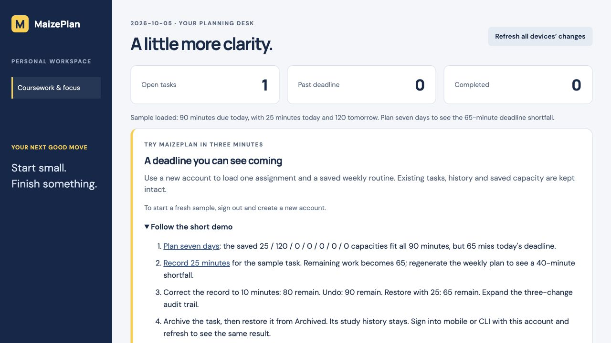

# MaizePlan

**Make room for what matters — a coursework planner that turns available time into an actionable study plan.**

**Student:** Gehao Dong / dgehao  
**UMID:** 62168169  
**Course:** EECS 449 / CSE449-F26 — Assignment 1  
**Built with:** Jac 0.37.21 · persistent Jac server · web frontend · MobUI / React Native mobile app · Jac CLI

MaizePlan is a personal coursework planner for students. Add assignments with a course, deadline, priority, and estimated remaining minutes, then enter how much time you have available. MaizePlan suggests focused study blocks and shows work that cannot fit before its deadline. Recording actual study changes the next plan; correcting a mistake preserves the history behind that change.

**The workflow: capture → plan → study → correct → replan.** Web, phone, and terminal all use the same authenticated server, planning rules, and persistent data. The application runs without an LLM key, paid API, or external calendar account.

[Run the project](#start-the-web-app-and-server) · [Three-minute demo](#three-minute-demo) · [Review walkthrough](#review-walkthrough) · [Mobile instructions](#mobile-app) · [CLI instructions](#cli) · [Validation evidence](VALIDATION.md)

## First time using MaizePlan?

1. Complete the [prerequisites](#prerequisites) and [setup steps](#start-the-web-app-and-server). On Apple Silicon macOS, follow the documented Python environment step before installing project dependencies.
2. From the repository root, run `jac install`, then `jac run`. Open the printed web URL, normally `http://localhost:8000`, and create a MaizePlan account.
3. Click **Load sample week** to try the [three-minute demo](#three-minute-demo), or add your own assignment and choose **Make my plan**. Use **Record your study** after working, or **Seven-day workload plan** to plan a week.
4. Keep the server running. Follow the separate [mobile](#mobile-app) or [CLI](#cli) instructions and sign into the same MaizePlan account. Use **Refresh** after changing data on another interface.

The web app and server run together on your computer. A physical phone runs the mobile client and connects to that computer's API; its setup requires the separate mobile instructions below. The [review walkthrough](#review-walkthrough) provides a worked example after setup.

## What makes MaizePlan stand out

| Design choice | Implemented behavior | Why it matters |
|---|---|---|
| **Planning that respects deadlines and available time** | Earliest deadline first, priority as a tie-breaker, up to 25-minute focus blocks, and 5-minute breaks included in the budget. Large tasks can be split across days. | Produces a concrete next action that fits the available time. Later catch-up capacity does not hide an earlier deadline shortfall. |
| **A weekly routine you can see** | Save Monday–Sunday capacity once; reuse it across interfaces and rotate it to any starting weekday. The workload chart shows focus, breaks, free time, days off, and late work. | Makes a busy week understandable and lets the user compare different capacities before committing effort. Forecasts leave stored tasks unchanged. |
| **Study progress feeds the next plan** | Actual study reduces remaining effort and completes a task at zero. Actual minutes and credited minutes are stored separately. | A 100-minute study record against 30 remaining keeps the full 100-minute history while deducting only 30. Estimates never become negative. |
| **Mistakes are recoverable** | Correct, undo, and restore study records with an immutable revision trail. Preserve newer manual estimates and explicit manual completions. Archive and restore tasks without losing their history. | Supports continued use as plans change, with an explanation of how each correction affected the remaining work. |
| **Meaningful workflows on every interface** | Organize and edit on web, record study on mobile, and capture or revise from the CLI. All three clients call the same Jac backend. | A change made on one interface is available to the others after refresh; tasks, history, archives, and weekly capacity stay in one account. |
| **Reliability that can be inspected** | Account isolation, request IDs for repeat submissions, stale-revision rejection, forecast invalidation after refresh, and process-restart checks. | The accompanying tests verify accounting and shared state against a running server, including sequential retries after restart. |

The web also includes task search, open/completed/archived views, summary counts, and full task editing. The mobile app uses MobUI / React Native controls. The CLI provides readable output, an ASCII workload chart, and `--json` for inspection or scripts.

## Four Jac components, one planning model

| Component | Main source | Role in the workflow |
|---|---|---|
| **Server** | [core/api.jac](core/api.jac), [core/planning.jac](core/planning.jac) | Owns authentication-scoped task storage, study records and revisions, weekly capacity, and all scheduling/accounting rules. |
| **Web** | [web/Planner.jac](web/Planner.jac), [web/Progress.jac](web/Progress.jac) | Organize coursework, edit estimates, compare plans, inspect workload and revision history. |
| **Mobile** | [mobile/Phone.jac](mobile/Phone.jac), [mobile/Progress.jac](mobile/Progress.jac) | Capture tasks, complete or archive them, record/correct study, and consult the weekly plan using native controls. |
| **CLI** | [cli/main.jac](cli/main.jac) | Capture and inspect tasks, log/correct study, save capacity, generate plans, and output JSON from a terminal. |

`web/main.jac` registers the protected planning endpoints. Web and mobile share [core/client.jac](core/client.jac) for authentication and HTTP transport; the Jac CLI uses Python's standard HTTP library. Persistent `Task`, `StudySession`, `StudyChange`, and `WeeklyCapacity` nodes belong to the authenticated user's graph root. Clients display server results and refresh shared data explicitly.

The [workspace configuration](jac.toml) selects `web` as the default app. After the prerequisites and dependencies are installed, **`jac run` from the repository root starts the web application and its server together**. Mobile and CLI launch commands are documented below.

## Three-minute demo

Start `jac run`, open its web URL, and create a **new account**. Click **Load sample week** near the top of the workspace. It creates **Finish EECS 449 report**, due on the day you load it, with **90 minutes** remaining. It also saves **25 minutes today, 120 tomorrow, and zero on the other five days**. No manual date or capacity setup is needed. Expand **Follow the short demo** in the app for the same steps and links to the relevant controls.

| Time | Action | What to notice |
|---|---|---|
| 0:00–0:45 | Load the sample, follow **Plan seven days**, then click the planning button. | All 90 minutes fit across the week, yet **65 minutes miss today's deadline**. Tomorrow's work is marked late/catch-up. |
| 0:45–1:30 | Under **Record your study**, select the report and record **25 minutes**. Generate the weekly plan again. | **65 minutes remain**, history shows **25**, and the deadline shortfall drops to **40**. |
| 1:30–2:30 | Correct that record to **10**, undo it, then restore it with **25**. Expand the audit trail. | Remaining work goes **80 → 90 → 65**. The original record and all three revisions remain visible. |
| 2:30–3:00 | Archive the report, switch to **Archived**, and restore it. | The task leaves the active list without losing its study history, then returns with **65 minutes** remaining. |

For a cross-device finish, sign into mobile or CLI with this account and refresh: the same task, history and capacity appear. The longer walkthrough below moves actions between all three clients.

The sample can also be loaded from the empty mobile workspace with **Load sample week** (which opens Progress), or after CLI login with `jac run cli sample`. On mobile, choose **Plan seven days** in Progress to begin. The server only seeds an account with no tasks, study history or saved capacity. It never clears existing work. Sequential repeat requests return the original sample reference without duplicating tasks or resetting progress. To replay from the beginning, use another new account. Dates stay anchored to the loading day; use that date for forecasts if continuing later.



## Review walkthrough

After setup, use a fresh MaizePlan account and the same planning server in each interface. **Load sample week** performs the task creation and capacity setup in steps 1–2 below; you only need to generate the plan. Alternatively, enter those values manually. Keep the study date and forecast start on **today** for the numbers below; the account should contain only the example task.

| Step | Action | What to observe |
|---|---|---|
| 1. Capture the work | On web, add **Finish EECS 449 report**, due today, with **90 minutes** remaining. | The task appears with its course, deadline, priority, and remaining effort. |
| 2. Make the constraint visible | Set today's capacity to **25**, tomorrow's to **120**, and the other five days to **0**. Save weekly capacity and generate the plan. | All 90 focus minutes can fit across the horizon, but **65 minutes cannot fit by today's deadline**. Tomorrow's blocks are labeled late/catch-up. Planning has not reduced the task's 90-minute estimate. |
| 3. Study on another interface | Sign into mobile with the same account. Open Progress, load the saved capacity, and record **25 minutes** against the task. Refresh web and regenerate its plan. | Both show **65 minutes remaining** and **25 recorded**. The deadline shortfall is now **40 minutes**. Refresh removes the old forecast before regeneration. |
| 4. Correct from the terminal | Run `jac run cli login YOUR_USERNAME`, then `jac run cli history`. Copy the study record ID and run `jac run cli correct FULL_STUDY_RECORD_ID --minutes 10`. Refresh web. | Remaining effort becomes **80**, active history becomes **10**, and the audit retains the original 25-minute record. |
| 5. Recover an accidental entry | On web, undo that record, then restore it with **25 minutes**. Inspect its audit trail. | Undo returns remaining effort to **90**; restoring 25 returns it to **65**. The original and all three revisions remain inspectable. |
| 6. Keep the workspace useful | Archive the task on web. Run `jac run cli list --all` and `jac run cli list --archived`. Refresh mobile Tasks and restore it from the archive. | The archive disappears from active plans and lists while its study history remains. Restoring it keeps its remaining effort and completion state. |

This walkthrough exercises all four components through one planning scenario. [The automated checks](#tests-and-demonstration) also cover account isolation, invalid input, repeat requests, manual re-estimation, and server restarts.

## Verification at a glance

The baseline validation on **2026-09-26 with Jac 0.37.21** includes:

- **12 scheduler unit tests passed**, including break budgets, partial allocations, deadline shortfalls, days off, and archive exclusion.
- **All 3 app roots passed `jac check` with warnings**; web and React Native Web builds succeeded.
- **Three real API/CLI integration scripts passed**, along with their process-restart checks for tasks, history, saved capacity, archives, and correction retries.
- **Web and mobile browser-preview workflows were exercised together**, including shared capacity, correction/undo/restore, archive/restore, refresh consistency, and chart layout at phone width.

**Mobile-app verification is complete.** The baseline application revision (`4903800`) also passed installation and default startup from a fresh GitHub checkout with a new project environment and database. The six-step review walkthrough and all three integration scripts' restart checks passed. Expo/Metro served both Android and iOS JavaScript bundles after the mobile startup adjustment documented below. The **2026-10-05 sample/demo update** passed scheduler tests, app checks, web/mobile browser builds and all four API/CLI scripts, with the new buttons exercised on web and React Native Web. [VALIDATION.md](VALIDATION.md) records the scope of each run.

## Scope and design boundaries

MaizePlan generates deterministic suggestions; it does not book calendar events or measure time with a timer. All open, unarchived tasks are eligible for scheduling. Daily budgets include breaks; weekly deadline warnings cover deadlines through the selected horizon. Study records update the current estimate, including when backdated, rather than reconstructing historical plans.

Cross-device synchronization uses explicit refresh. Notifications, offline operation, external calendar integration, signed mobile binaries, and store distribution are outside the delivered scope. Sequential retry and restart behavior has been tested; arbitrary concurrent-client guarantees are not claimed.

## Prerequisites

1. Install **Jac 0.37.21** from the [official repository](https://github.com/jaseci-labs/jac/releases/tag/v0.37.21). Use the release appropriate for your operating system and CPU. Do not replace it with an older PyPI `jaclang` installation; this project uses the current workspace/MobUI toolchain.
2. Install VS Code and its Jac extension, as recommended by the course.
3. Have an internet connection for the first dependency and embedded database downloads. Jac supplies its own Python/Bun toolchain. The optional integration script uses system Python 3.10+.
4. Run Jac as your normal desktop user, **not with sudo/root**. The runtime provisions embedded PostgreSQL. If automatic provisioning is unavailable, configure a working external PostgreSQL instance using `JAC_DB_URL` according to `jac guide jac-sv-persistence`.

Official installer (inspect it before executing):

```bash
curl -fsSL https://raw.githubusercontent.com/jaseci-labs/jaseci/main/scripts/install.sh | bash -s -- --version 0.37.21
jac --version
```

The locally tested platform is Apple Silicon macOS. Use a supported binary for your platform; syntax and workspace behavior are version-sensitive.

## Start the web app and server

From a fresh checkout, enter the repository root. On Apple Silicon macOS with Jac 0.37.21, create the project environment with Homebrew Python **before** installing dependencies:

```bash
brew install python@3.14
"$(brew --prefix python@3.14)/bin/python3.14" -m venv .jac/venv
```

This avoids a locally reproduced bundled-Python `pyexpat` symbol failure that prevents `ensurepip` from installing pip. If `.jac/venv` already exists and `jac install` reports missing pip, stop the app, preserve that environment, and recreate only the venv:

```bash
mv .jac/venv ".jac/venv-backup-$(date +%Y%m%d-%H%M%S)"
"$(brew --prefix python@3.14)/bin/python3.14" -m venv .jac/venv
```

Do not remove `.jac/data`. On other supported platforms, first try the ordinary Jac installation. Then:

```bash
jac install
jac run
```

Open the URL printed by Jac (normally `http://localhost:8000`). The default app is `web`; one command starts its frontend (8000) and backend API (8001). Web requests use the frontend proxy; CLI and mobile default to API port 8001. If ports differ, use the API URL printed by Jac. Create an account with a unique username and a password of at least 8 characters, then add a task. An email address is not needed. Use the same username/password on the other interfaces.

The server binds to loopback by default. Task data belongs to the server's persistent graph, not browser local storage. Tokens stay in web/mobile memory only: refreshing the page or restarting the mobile app requires signing in again, but must not erase tasks. Click **Refresh** after another device changes data; synchronization is manual, not real-time push.

## CLI

Keep the server running in another terminal. Run these from the repository root:

```bash
jac run cli login YOUR_USERNAME
# Or create an account:
jac run cli register YOUR_USERNAME

# Optional: one-time example for a new, empty account.
jac run cli sample

jac run cli add "Finish planner README" --course "EECS 449" --due 2026-10-05 --priority 3 --minutes 60
jac run cli list
jac run cli list --today
jac run cli list --all
jac run cli --json list
jac run cli plan --day 2026-10-05 --minutes 120
jac run cli study FULL_TASK_ID --minutes 25
jac run cli history
jac run cli history --audit
jac run cli correct FULL_STUDY_RECORD_ID --minutes 20 --day 2026-09-25
jac run cli undo-study FULL_STUDY_RECORD_ID
jac run cli capacity --budgets 60,90,0,120,60,0,30
jac run cli capacity
jac run cli week --start 2026-10-05
jac run cli week --start 2026-10-05 --budgets 60,90,0,120,60,0,30
jac run cli archive FULL_TASK_ID
jac run cli list --archived
jac run cli restore FULL_TASK_ID
jac run cli done FULL_TASK_ID
jac run cli reopen FULL_TASK_ID
jac run cli logout
```

Copy the full `ID:` value printed by `list`; IDs are not task titles or row numbers. `--today` includes overdue tasks. Global options belong **before** the command:

```bash
jac run cli --server http://127.0.0.1:8001 --json list
```

Passwords are entered using a hidden prompt and never saved. CLI login stores a token and exact server URL in `.jac/cli-session.json` with owner-only permissions. Logout removes only this local session, not tasks. `.jac/` must never be committed. For scripts, `MAIZEPLAN_TOKEN` may supply a token instead of the local session file. The CLI refuses to reuse a token for a different saved server URL.

## Study progress and multi-day planning

On the web, use **Record your study** and **Seven-day workload plan** below the daily focus planner. On mobile, open **Progress**. The CLI provides `study`, `history`, `correct`, `undo-study`, `capacity`, and `week`.

1. Choose an open task, enter the study date and actual focus minutes (1–1440, excluding breaks), then record the session. Dates cannot be later than the server's current date. A 90-minute task becomes 65 minutes after a 25-minute session.
2. History preserves actual minutes and the amount deducted. Recording 100 minutes against 65 remaining preserves 100 actual minutes, deducts 65, and completes the task at zero. Correct or undo a record as described below; to add a new remaining estimate to a completed task, edit it on the web and reopen it.
3. Set the forecast start date and each day's available time. Use 0 for a day off or 5–720 minutes including breaks. **Save weekly capacity** stores the seven inputs as your repeating weekday routine. Web/mobile show seven days; CLI/API accept 1–14 explicit daily budgets. The scheduler carries unfinished work forward, with breaks restarting each day.
4. Review **Deadline shortfall**, **Already overdue**, and **unscheduled** minutes. A task due today cannot be considered on time merely because tomorrow has capacity. Warnings cover deadlines through the forecast's final day; later deadlines are outside that assessment. Blocks after their deadline are marked as catch-up.

After another interface changes tasks or study history, use the web's **Refresh all devices’ changes**, mobile's **Refresh from server**, or **Refresh tasks & study history** in Progress. Each reloads both tasks and study history. Refreshing, editing, completing, archiving, or changing study records clears previous plans; regenerate them from the updated tasks. Refreshing keeps the weekly start date and daily capacities in the current Progress screen. Use **Load saved capacity** to fetch capacity changes made on another device. Forecasts are not saved calendars. Backdated sessions reduce the current estimate; they do not reconstruct historical plans.

For an uncertain CLI submission, retry with the same fields and the request ID printed to stderr: `jac run cli study FULL_TASK_ID --minutes 25 --day YYYY-MM-DD --request-id PREVIOUS_ID`. A previously saved request returns its existing record without deducting twice. Web/mobile retain the request ID after a failed submission while the fields remain unchanged; changing fields or reloading starts a new request.

### Saved capacity and workload chart

The saved routine uses **Monday through Sunday**, including in `capacity --budgets`. A seven-day forecast automatically rotates it to the selected start date: starting on Wednesday uses Wednesday's capacity first. The initial unsaved suggestion is 60 minutes on weekdays and zero on weekends. Changing the start date reloads the current routine; unsaved edits apply only to the current forecast. CLI `week` without `--budgets` uses the saved routine; an explicit `--budgets` starts on `--start` and does not overwrite it.

The web/mobile chart shows focus time, breaks, and unused capacity on one shared minutes scale; the CLI prints a text chart. Each day includes exact counts, days off, late catch-up, and due/overdue work still remaining. Spare time later in the week does not remove an earlier deadline shortfall. Generating a chart does not change task estimates.

### Correct or undo study records

Choose **Correct record** to edit the date or actual minutes, **Undo record** to exclude it from totals, or **Restore record** to bring it back. The CLI uses the study record ID printed by `history`; `correct` also restores an undone record. Originals are retained, and every successful correction adds a revision visible in **view audit trail** or `history --audit`.

The server restores the record's previously credited minutes before applying its replacement, capped by the available remaining estimate. For example, a 25-minute record against a 90-minute task leaves 65; correcting it to 10 leaves 80; undoing it leaves 90. Undoing a 100-minute record that deducted only 30 restores 30, not 100. Automatically completed tasks reopen when effort is restored; an explicit manual completion is preserved.

If the task's remaining estimate was manually changed after the original record, its corrections change history only and preserve that newer estimate. The UI reports this outcome. A stale record version is rejected and requires refreshing history. For an uncertain CLI correction, reuse the printed `--request-id` **and** `--version` together with the same date/minutes/operation. Sequential retries, including after restart, do not apply the adjustment twice. The same original `study` request also returns the record's current effective state after later revisions.

### Archive tasks without losing history

Use **Archive task** on web/mobile or `archive` in the CLI. Archived tasks leave the active list, summary counts, daily plans, and weekly plans. **Archived** on the web, **Show archived tasks** on mobile, and `list --archived` in the CLI show them again. **Restore task** / `restore` retains their remaining effort and completion state.

Archiving preserves study records and their audit trail. Existing records can still be corrected while a task is archived; restore the task before editing its details, changing completion, or recording new study time. Archiving is reversible and does not delete data.

## Mobile app

The mobile UI is written in Jac (`mobile/Phone.jac`) using MobUI / React Native. It provides **Tasks**, **Add**, **Focus**, and **Progress** screens connected to the same planning API as the web and CLI. The phone runs the mobile client; the computer must keep serving both the backend and the development bundle.

### Runtime and build options

**Expo Go and Expo SDK 57 are different concepts.** Expo Go is a prebuilt development client installed on a phone. Expo SDK 57 is the framework/library version selected by the current Jac-generated mobile scaffold. SDK 57 can be used with Expo Go, a custom development client, or a standalone app.

| Route | What runs on the phone | Build environment |
|---|---|---|
| Compatible Expo Go | MaizePlan's development bundle inside Expo Go | Jac + Metro on the computer; no local iOS app compilation |
| Custom development build | A dedicated MaizePlan development app with its own native dependencies | Local native tools or EAS Build; requires additional `expo-dev-client` configuration |
| Standalone app | An installed MaizePlan app with its bundled UI | Local Android/iOS tools or a configured cloud builder; signing/distribution depends on platform |
| Browser preview | The mobile UI rendered through React Native Web | Jac browser build; useful for previewing screens and backend workflows |

Local versus cloud describes **where compilation happens**, not a different mobile UI implementation. EAS Build can compile in the cloud without full Xcode installed on your computer. Development builds still load development code through Metro; a standalone release bundles its UI, but still needs a reachable planning backend.

The detailed phone workflow below uses Expo Go. Custom development builds and EAS distribution are alternatives requiring their own configuration; this repository does not include a published cloud build or signed binary. See Expo's [development-build overview](https://docs.expo.dev/develop/development-builds/introduction/), [cloud build setup](https://docs.expo.dev/build/setup/), and [local build overview](https://docs.expo.dev/guides/local-app-overview/).

You may use VS Code for every route. Local iOS compilation/simulators require Apple's Xcode toolchain. Mobile-app verification is complete; additional checks cover Expo/Metro bundles and React Native Web UI/backend workflows. See [VALIDATION.md](VALIDATION.md) for the recorded results.

### 1. Prepare a compatible phone client

Complete the Jac 0.37.21 and project setup above. Connect your computer and phone to the same trusted Wi-Fi network.

The current Jac scaffold generates **Expo SDK 57** (`"expo": "~57.0.0"` in `.jac/mobile-rn/package.json`). The installed Expo Go must support that SDK:

- **Android phone:** visit [Expo Go downloads](https://expo.dev/go), select SDK 57 and Android physical device, and follow the official installation instructions. Do not assume the Play Store version matches.
- **iPhone:** current Expo documentation says the App Store Expo Go stops at SDK 54. For this SDK 57 project, follow the official [physical iPhone instructions](https://docs.expo.dev/troubleshooting/expo-go-version-mismatch/#physical-iphone-or-ipad): `eas go` can build a compatible Expo Go for distribution through a TestFlight internal team and requires Apple Developer Program membership. This is a separate cloud/account setup, not a local Xcode build. If that setup is unavailable, use a compatible Android phone rather than expecting the App Store client to work.

Recheck the [official compatibility guide](https://docs.expo.dev/troubleshooting/expo-go-version-mismatch/) if the SDK/client versions change. Do not downgrade Expo alone: React Native and the Jac scaffold dependencies must remain compatible.

### 2. Start the shared planning server — terminal A

Find the computer's LAN IPv4 address in its Wi-Fi/network settings, for example `192.168.1.42`. On macOS, `ipconfig getifaddr en0` may show it; if it returns nothing, use the active Wi-Fi interface shown in Settings. Replace the example IP everywhere below with your actual address.

Stop any existing `jac run` in this project with Ctrl+C, then run from the repository root:

```bash
jac run --host 0.0.0.0 --port 8000 --api-port 8001
```

Keep terminal A open. Web uses port **8000**, and planning API requests use port **8001**. On the phone, open `http://192.168.1.42:8000` in its browser to check basic network reachability. This browser check is not the mobile app itself. Create an account on the web, or use an existing MaizePlan account.

Use a trusted network, and change Jac's default administrator credentials before making the development server LAN-accessible. Use HTTPS for a remotely hosted backend; this project does not provision one.

### 3. Start the mobile development bundle — terminal B

Jac 0.37.21's mobile dev command also starts a helper API process. To keep that process separate from the planning server's database/session, run it from an isolated source copy. In a **second terminal, initially at the original repository root**, run:

```bash
# macOS/Linux shell; copies source only, not user data or tokens.
PHONE_WORKSPACE="$(mktemp -d "${TMPDIR:-/tmp}/maizeplan-phone.XXXXXX")"
cp jac.toml "$PHONE_WORKSPACE/"
cp -R core web mobile cli "$PHONE_WORKSPACE/"
cd "$PHONE_WORKSPACE"
jac setup mobile

# Jac 0.37.21 workaround: keep its helper process in API-only mode.
# Apply only in this temporary phone workspace, after jac setup mobile.
python3 - <<'PY'
from pathlib import Path
config = Path("jac.toml")
source = config.read_text()
section = '[apps.mobile]\nkind = "mobile"\n'
assert source.count(section) == 1
config.write_text(source.replace(section, section + 'platform = "web"\n'))
PY

# Replace this example with your computer's LAN IP.
JAC_RN_DEV_HOST=192.168.1.42 jac run --dev --platform android --port 8002 --api-port 8002 mobile
```

`jac setup mobile` downloads the Expo dependencies. The configuration adjustment avoids a reproduced Jac 0.37.21 issue where its helper process unexpectedly starts an Android native build. Keep both the temporary `platform = "web"` setting and the explicit `--platform android` argument: together they start the native development bundle and an API-only helper. This command serves Expo/Metro for compatible **Android or iOS** clients; both JavaScript bundles were checked. It does not build an APK or IPA.

Keep terminal B open. Metro normally uses **8081**; use the actual address/QR code printed in the terminal. If the Expo terminal is targeting a development build, use its displayed option to switch to Expo Go.

This temporary workspace is only for serving mobile code. The phone must use the **original planning API on 8001**, not the helper API on 8002, even if Jac prints 8002 as its dev API. MaizePlan's explicit **Server URL** field controls its task requests. Source edits in the original directory do not update this copy; recreate the copy when you want to try changed source. On Windows, use a separate source-only copy/checkout and set `JAC_RN_DEV_HOST` using your shell's environment-variable syntax.

### 4. Open MaizePlan on the phone

1. With a compatible Expo Go installed, scan the Metro QR code. On Android, use the Expo Go scanner; on iPhone, use Camera and open the link in the compatible Expo Go app.
2. If iOS asks for local-network access, allow it so the app can reach your computer. Wait for the bundle to load and the MaizePlan login screen to appear.
3. Replace the login screen's **Server URL** with `http://192.168.1.42:8001` (your actual computer IP).
4. Sign in with the **same MaizePlan username/password** used on the web. This is distinct from any Expo account used to obtain the phone client.

Never leave `localhost` as the phone's Server URL: it refers to the phone itself. Metro's `exp://...:8081` address loads the app code; it is not the planning API URL.

Expo's [device-start guide](https://docs.expo.dev/get-started/start-developing/) describes the QR and Wi-Fi workflow.

### 5. Use the mobile screens

- **Tasks:** view course, deadline, estimate and priority; complete/reopen or archive/restore tasks. Tap **Refresh from server** after changing tasks on another interface.
- **Add:** enter a title, optional course, `YYYY-MM-DD` deadline, estimate of 1–1440 minutes, and priority 1–3; tap **Add task**.
- **Focus:** enter a planning date and a budget of 5–720 minutes; tap **Make my plan**. The budget includes breaks, and due/overdue work that does not fit is reported.
- **Progress:** record, correct, undo, or restore study sessions; view the audit trail; save weekly capacity and generate its workload chart with deadline warnings.
- **Sign out:** ends the in-memory session. Tasks remain on the backend; reopening/reloading the app requires signing in again.

For a cross-device demo, add a task on the web, refresh Tasks on the phone, complete it on the phone, and refresh the web's Done view. Run `jac run cli list --all` from the **original project directory** to see the same task. Reopen it with `jac run cli reopen FULL_TASK_ID`, then refresh the phone. No automatic live synchronization is implemented.

### Troubleshooting

| Symptom | What to check |
|---|---|
| “Project is incompatible with this version of Expo Go” | Match the scaffold's Expo SDK to the phone client using the compatibility guide above; ordinary App Store Expo Go is not sufficient for SDK 57. |
| QR opens no app / bundle cannot load | Check the compatible client, terminal B, actual Metro address/port, same Wi-Fi, local-network permission, and firewall access. Campus/guest Wi-Fi may block device-to-device traffic. |
| App opens but login/tasks fail | Check terminal A, the explicit Server URL, and port 8001. A working Metro bundle does not establish API reachability. |
| Phone shows different/empty tasks | Use the original server and same MaizePlan account, then Refresh. Do not connect to the mobile helper API on 8002. |
| Mobile dev unexpectedly downloads Android build tools or asks for SDK licenses | Stop terminal B. Apply the temporary-workspace configuration adjustment in step 3 and retain `--platform android` in the dev command. The Expo route does not need a standalone native build. |
| Ports/database already in use | Stop the previous process you launched, and keep mobile dev in the separate source copy. Do not delete `.jac/data` or take over the original server session. |
| Native-module or generated-code error | Record the exact message and SDK/client versions. Check that the chosen client includes the required native modules; use the selected build route’s diagnostics. |

An Expo tunnel only makes the development bundle reachable; it does not automatically expose the separate planning API. Prefer a trusted network that permits direct LAN access for this workflow. Stop both development terminals with Ctrl+C when finished; preserve the original project's `.jac/data`.

### Optional browser preview

Keep the original `jac run` running. In another terminal at the original repository root:

```bash
jac build --platform web mobile
python3 -m http.server 8010 --bind 127.0.0.1 --directory .jac/client/mobile/dist
```

Open `http://127.0.0.1:8010` and set **Server URL** to `http://127.0.0.1:8001`. This tested route renders the mobile source through React Native Web; it is not evidence of phone execution.

### Optional standalone native builds

EC1 does not explicitly request IPA/APK packaging or App Store distribution. The following commands are optional alternatives, with platform-specific prerequisites:

```bash
jac setup mobile
jac build --platform android mobile
# Requires full Xcode and the iOS toolchain for a local build:
jac build --platform ios mobile
```

See `jac guide jac-mobile-app` for platform prerequisites and the `android_builder` / `ios_builder` settings for EAS. Cloud builds require Expo account/project configuration and appropriate signing credentials. Expo Go development does not invoke the standalone iOS packaging step.

## Tests and demonstration

```bash
jac test core/planning.jac
jac check
jac build web
jac build --platform web mobile
```

With the real backend running, run:

```bash
python3 scripts/smoke_test.py
python3 scripts/feature_test.py
python3 scripts/lifecycle_test.py
python3 scripts/sample_test.py
```

The scripts create uniquely named **test accounts** and test tasks on the selected development server. The smoke script tests authentication, isolation (including cross-account edits), invalid input rejection, edits, CLI capture/completion, and exact CLI/API planning consistency. The scripts do not remove those accounts or modify real users' tasks. Run only against your development instance.

The feature script also creates two disposable accounts and checks study deductions, repeat-request handling, account isolation, weekly capacity validation, and exact CLI/API multi-day plan equality.

The lifecycle script checks saved weekday capacity and date rotation, correction/undo/restore accounting and audit history, request replay and stale versions, manual estimate/completion preservation, archives and plan exclusion, and CLI/API parity.

The sample script checks the one-click setup, the demo's 65-to-40-minute shortfall, weekday rotation, API/CLI parity, account isolation, repeat requests, and preservation of existing tasks/history/capacity.

To verify persistence reproducibly:

```bash
python3 scripts/smoke_test.py --write-restart-state .jac/restart-check.json
python3 scripts/feature_test.py --write-restart-state .jac/features-restart.json
python3 scripts/lifecycle_test.py --write-restart-state .jac/lifecycle-restart.json
# Stop the server with Ctrl+C, then restart it with jac run.
python3 scripts/smoke_test.py --verify-restart-state .jac/restart-check.json
python3 scripts/feature_test.py --verify-restart-state .jac/features-restart.json
python3 scripts/lifecycle_test.py --verify-restart-state .jac/lifecycle-restart.json
```

The state files contain disposable test account tokens and expected task/history snapshots, are owner-readable only, and remain under ignored `.jac/`. Use the same `--server` URL for both commands when overriding the default.

Use the [review walkthrough](#review-walkthrough) for the main cross-interface demonstration. Additional manual checks include editing and completing/reopening tasks, signing into a second account to confirm isolation, and disconnecting the backend to observe errors before reconnecting. On a native phone, also check keyboard behavior, scrolling, and backend reachability for the latest controls.

[VALIDATION.md](VALIDATION.md) distinguishes recorded results from additional demonstration scenarios and documents the setup and compiler version used for each check.

## Submission

EC1 is submitted as a GitHub repository link through Canvas. Include the Jac source, `jac.toml`, tests, README, and validation record. Keep `.jac/`, tokens, databases, `node_modules/`, and generated build artifacts out of version control. The student identity is listed at the top of this document.

## Resources and attribution

- [Course syllabus](https://github.com/marsninja/CSE449-F26)
- [Official Jac source and complete workspace](https://github.com/jaseci-labs/jac/tree/main/jac/examples/jaclang_org)
- [Jac documentation](https://jaclang.org/docs/latest)
- [Course-provided AI day-planner guide](https://jaclang.org/docs/v0.37/tutorials/first-app/build-ai-day-planner)
- Bundled Jac 0.37.21 guides: essentials, fullstack patterns, persistence/auth, MobUI, mobile app, client components, and testing.

The task planner, UI, tests, and documentation were developed with AI assistance. Workspace organization and language patterns follow the official examples.
